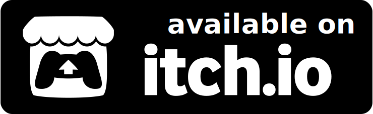

# Chest Dash

<p align="center">
    <a href="https://adiharif.itch.io/chest-dash">
        
    </a>
</p>

**Chest Dash** is an arcade style game where you need to collect points as fast as you can, by placing your chests on gold nugget tiles. You play against an AI opponent who is trying to do the same, first player to reach 50 points wins!

This game was created as part of a 24 hour coding marathon, which was live streamed on [Twitch](https://www.twitch.tv/dushkycodes).


<p align="center">
    
</p>

## Play the Game

Chest Dash id available on [itch.io](https://adiharif.itch.io/chest-dash).

You may also download the game and play it locally (requires cargo and rust installed):

```bash
git clone https://github.com/AdiHarif/Chest-Dash
cd Chest-Dash
cargo run --release
```

## Acknowledgements

Credits for the assets used in the game:
- Sprites, including tiles, chests and players - by [Game Endeavor](https://game-endeavor.itch.io/)
- Background Music - "I've Got Your Back!" by [Bit by Bit Sound](https://bit-by-bit-sound.itch.io/)
- Sound Effects - from [mixkit](https://mixkit.co/) and [Pixabay](https://pixabay.com/)